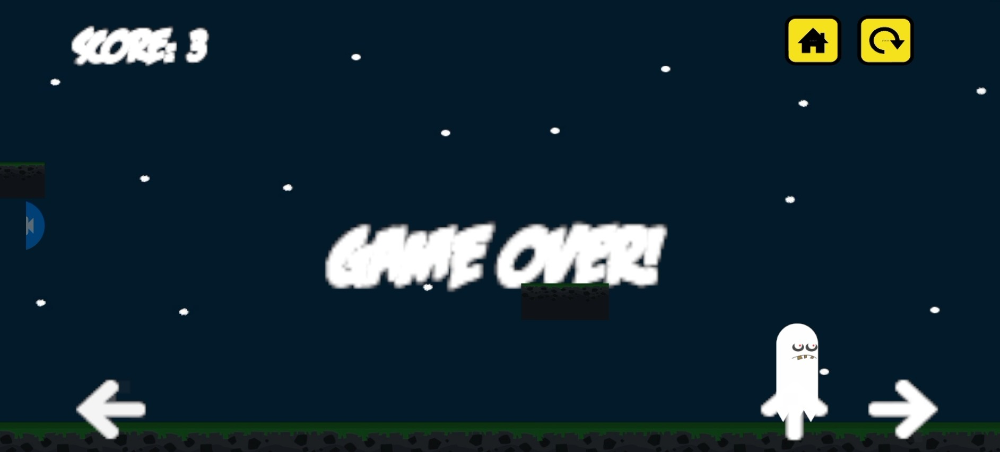
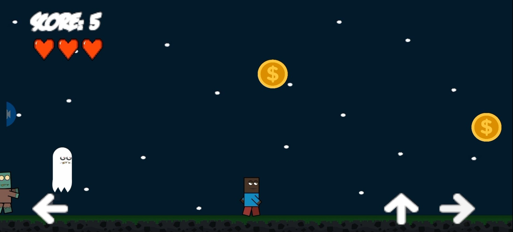
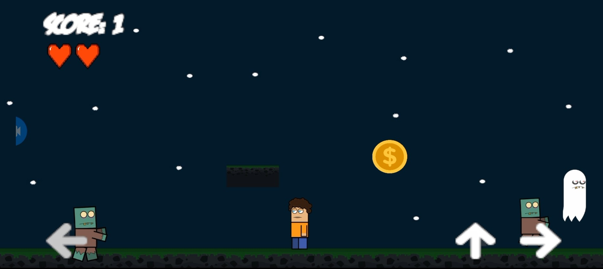
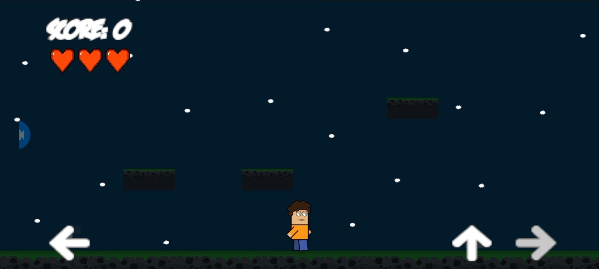
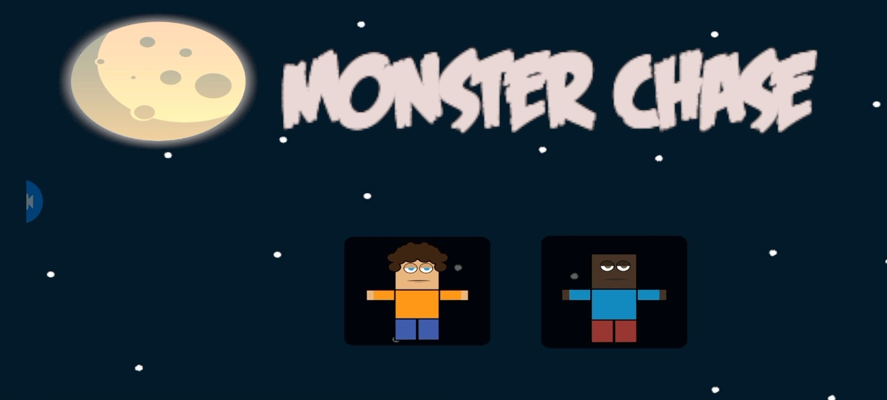

# Monster Game 2D
**A 2D endless runner game where players dodge monsters and collect coins to achieve the highest score**

## Table of Contents
- [Overview](#overview)
- [Features](#features)
- [Technical Specifications](#technical-specifications)
- [Prerequisites](#prerequisites)
- [Installation](#installation)
- [Screenshots](#screenshots)
- [Contributing](#contributing)
- [License](#license)

## Overview
**Monster Game 2D** is an engaging 2D endless runner game built with Unity. Players control a character who must navigate through an infinite landscape while avoiding incoming monsters and collecting coins. The game features smooth animations, responsive controls optimized for both desktop and mobile platforms, and an intuitive scoring system with a lives-based challenge mechanism.

This project demonstrates core Unity game development concepts including 2D physics, animation systems, UI management, scene transitions, and mobile touch controls.

## Features
### Core Gameplay
- **Endless Runner Mechanics** - Infinite scrolling gameplay with progressively challenging obstacles
- **Monster Avoidance** - Dynamic monster spawning system with collision detection
- **Coin Collection** - Random coin generation for score accumulation
- **Lives System** - Three-heart health system with visual feedback
- **Character Selection** - Multiple playable characters with persistent selection across scenes

## Technical Specifications
| Component | Details |
|-----------|---------|
| **Engine** | Unity 2022.3.59f1 LTS |
| **Scripting Language** | C# (.NET Standard 2.1) |
| **Target Platform** | Android |
| **Render Pipeline** | Built-in Render Pipeline |
| **Physics Engine** | Unity 2D Physics |
| **UI System** | Unity UI (uGUI) |
| **Animation System** | Unity Animator with 2D Sprite Animation |
| **Scripting Backend** | IL2CPP |
| **API Compatibility Level** | .NET Standard 2.1 |

## Prerequisites
### Software Requirements
- **Unity Hub** (Latest version)
- **Unity 2022.3.59f1 LTS** (Exact version recommended)
- **Android Build Support** module for Unity (for mobile deployment)
- **Git** (for version control)
- **Visual Studio** or **Visual Studio Code** (for code editing)

## Installation
### 1. Clone the Repository
```bash
git clone https://github.com/m-ahmad-butt/2D-Game-Development.git
cd "2D-Game-Development"
```

### 2. Open in Unity
1. Launch **Unity Hub**
2. Click **"Open"** or **"Add"**
3. Navigate to the cloned project folder
4. Ensure Unity **2022.3.59f1** is installed
5. Unity will import all assets (this may take several minutes on first load)

### 3. Configure Build Settings
#### For Desktop (Windows/Mac/Linux)
1. Go to **File → Build Settings**
2. Select **PC, Mac & Linux Standalone** platform
3. Choose your target OS
4. Click **"Switch Platform"** if not already selected

#### For Android
1. Go to **File → Build Settings**
2. Select **Android** platform
3. Click **"Switch Platform"**
4. Under **Texture Compression**, select **ASTC**
5. Click **"Player Settings"** and configure:
   - **Company Name:** Your company/developer name
   - **Product Name:** Monster Game 2D
   - **Package Name:** com.yourcompany.monstergame2d
   - **Minimum API Level:** Android 7.0 (API Level 24) or higher

### 4. Build and Deploy
#### Option A: Build and Run (Desktop)
1. In Unity, go to **File → Build Settings**
2. Click **"Build and Run"**
3. Choose a location to save the executable
4. The game will launch automatically after building

#### Option B: Build APK (Android)
1. Enable **Developer Mode** on your Android device
2. Connect device via USB and enable **USB Debugging**
3. In Unity Build Settings, ensure device is recognized
4. Click **"Build and Run"** to install directly
5. Or click **"Build"** to create APK for manual installation

#### Option C: Install Pre-built APK
1. Locate `monsterChase.apk` in the project root
2. Transfer to Android device
3. Enable **"Install from Unknown Sources"** in device settings
4. Install the APK

## Screenshots
### Character Selection

*Main menu with character selection interface*

### Gameplay

*Player navigating through the level while avoiding monsters*


*Coin collection and score tracking in action*


*Multiple monsters approaching the player*

### Game Over

*Game over screen with restart options*

## Contributing
Contributions are welcome! Please follow these guidelines:
1. **Fork** the repository
2. Create a **feature branch** (`git checkout -b feature/AmazingFeature`)
3. **Commit** your changes (`git commit -m 'Add some AmazingFeature'`)
4. **Push** to the branch (`git push origin feature/AmazingFeature`)
5. Open a **Pull Request**

### Development Guidelines
- Follow Unity C# coding conventions
- Test changes on both desktop and Android platforms
- Document new features and changes in commit messages
- Ensure backward compatibility when possible
- Update README.md for significant feature additions

## License
This project is for educational purposes. All assets and code are provided as-is for learning and demonstration.